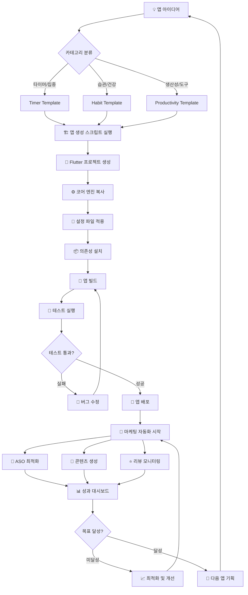

# 🏭 앱 공장 엔드투엔드 워크플로우

## 📋 전체 프로세스 다이어그램



## 🔄 세부 워크플로우

### 1️⃣ 아이디어 → 앱 생성 (자동화)

```bash
# 1단계: 아이디어 선정
💡 "집중력 향상 타이머 앱"

# 2단계: 템플릿 매핑 자동화
🎯 Category: productivity → timer_app_template.json

# 3단계: 앱 생성 (단 한 줄!)
./scripts/create_new_app.ps1 -AppName "Focus Timer Pro" -PackageName "com.focus.timer"

# 결과: 5분 안에 완성
✅ Flutter 프로젝트 생성
✅ 코어 엔진 자동 복사  
✅ 설정 파일 맞춤 생성
✅ 의존성 자동 설치
✅ 바로 실행 가능한 앱
```

### 2️⃣ 빌드 → 배포 (CI/CD)

```yaml
# GitHub Actions 자동 실행
trigger: assets/config/** 파일 변경
↓
🔧 Flutter 빌드 (Android + iOS)
↓  
🧪 자동 테스트 실행
↓
📱 APK/AAB 생성
↓
🚀 Play Store 자동 업로드
```

### 3️⃣ 마케팅 자동화 (즉시 실행)

```bash
# 배포 완료 후 자동 실행
python run_marketing_automation.py full --app-config app_config.json

# 5분 안에 완성되는 마케팅 자료
✅ ASO 키워드 최적화된 앱 설명
✅ 블로그 리뷰 포스트 (2000자)
✅ 유튜브 스크립트 (5분 분량)
✅ 리뷰 자동 응답 시스템 가동
✅ 성과 추적 시작
```

### 4️⃣ 성과 모니터링 → 최적화

```bash
# 실시간 대시보드 실행
streamlit run dashboard/streamlit_dashboard.py

# 모니터링 지표
📊 다운로드 수 실시간 추적
💰 수익 현황 (광고+구독+결제)
⭐ 리뷰/평점 변화 추이
🎯 ASO 키워드 순위 변화
```

## ⏱️ 타임라인 예시

### 🚀 신속 런칭 모드 (1일 1앱)

| 시간 | 작업 | 자동화 도구 |
|------|------|-------------|
| **09:00-09:30** | 아이디어 선정 및 리서치 | Manual + Google Trends |
| **09:30-09:35** | 앱 생성 | `create_new_app.ps1` |
| **09:35-11:00** | UI 커스터마이징 | Template + Manual |
| **11:00-12:00** | 테스트 및 버그 수정 | Manual |
| **13:00-13:10** | 빌드 및 배포 | GitHub Actions |
| **13:10-13:15** | 마케팅 자동화 실행 | `run_marketing_automation.py` |
| **13:15-14:00** | 스토어 페이지 최종 검토 | Manual |
| **14:00** | 🎉 **앱 출시 완료!** | |

**결과: 하루 5시간으로 앱 1개 완전 출시!**

### 📈 성장 모니터링 사이클 (주간)

| 요일 | 작업 | 자동화 |
|------|------|--------|
| **월요일** | 주간 성과 리포트 확인 | 자동 생성 |
| **화요일** | ASO 키워드 업데이트 | 2주마다 자동 |
| **수요일** | 리뷰 응답 및 피드백 반영 | 자동 응답 + Manual 검토 |
| **목요일** | 새 앱 아이디어 리서치 | Manual + AI 도움 |
| **금요일** | 신규 앱 개발 시작 | 자동화 도구 활용 |

## 🎯 성공 지표 추적

### KPI 대시보드 구성

1. **📱 앱 성과 지표**
   - 일일/월간 다운로드 수
   - 사용자 잔존율 (1일, 7일, 30일)
   - 평균 세션 시간
   - 앱 평점 및 리뷰 수

2. **💰 수익 지표**
   - 광고 수익 (배너, 전면, 보상형)
   - 구독 수익 (신규, 갱신)
   - 인앱결제 수익
   - 총 월간 수익

3. **🎯 마케팅 지표**
   - ASO 키워드 순위
   - 스토어 노출 수
   - 전환율 (노출→다운로드)
   - 리뷰 응답률

4. **🏭 공장 효율성 지표**
   - 앱 개발 소요 시간
   - 마케팅 자동화 성공률
   - 운영 비용 대비 수익
   - 포트폴리오 다양성

## 🚨 알림 및 대응 시스템

### 자동 알림 조건
- 📉 **다운로드 급감** (전일 대비 30% 이상 감소)
- ⭐ **평점 하락** (4.0 이하로 떨어짐)
- 💸 **수익 목표 미달** (월간 목표 대비 80% 이하)
- 🐛 **크래시 급증** (크래시율 5% 이상)
- 📱 **스토어 정책 위반** 경고

### 대응 액션 플랜
1. **즉시 대응** (1시간 이내)
   - 크래시 버그 수정
   - 스토어 정책 위반 대응
   
2. **단기 대응** (1주 이내)
   - ASO 키워드 재최적화
   - 리뷰 대응 강화
   - UI/UX 개선
   
3. **중기 대응** (1달 이내)
   - 기능 추가/개선
   - 마케팅 전략 변경
   - 새로운 수익화 모델 테스트

## 🎖️ 성공 사례 시나리오

### 시나리오 1: 타이머 앱 히트
```
월차별 성장:
1개월: 일 30다운로드 → 월 15만원
3개월: 일 80다운로드 → 월 45만원  
6개월: 일 150다운로드 → 월 95만원
12개월: 일 300다운로드 → 월 200만원

성공 요인:
✅ ASO 최적화로 "포모도로" 키워드 상위 노출
✅ 유튜브 리뷰 영상이 바이럴 (조회수 10만+)
✅ 사용자 피드백 빠른 반영으로 평점 4.6 유지
```

### 시나리오 2: 포트폴리오 다변화 성공
```
앱 구성 (12개월 후):
- 타이머 앱 3개: 월 180만원
- 습관 앱 3개: 월 120만원  
- 생산성 앱 3개: 월 100만원
- 틈새 앱 3개: 월 80만원
총합: 월 480만원

성공 요인:
✅ 카테고리별 특화 전략
✅ 마케팅 자동화로 운영 효율성 극대화
✅ 지속적 A/B 테스트로 전환율 개선
```

---

**이 워크플로우를 따르면 "아이디어 → 수익"까지 최단 경로로 연결됩니다! 🚀**
